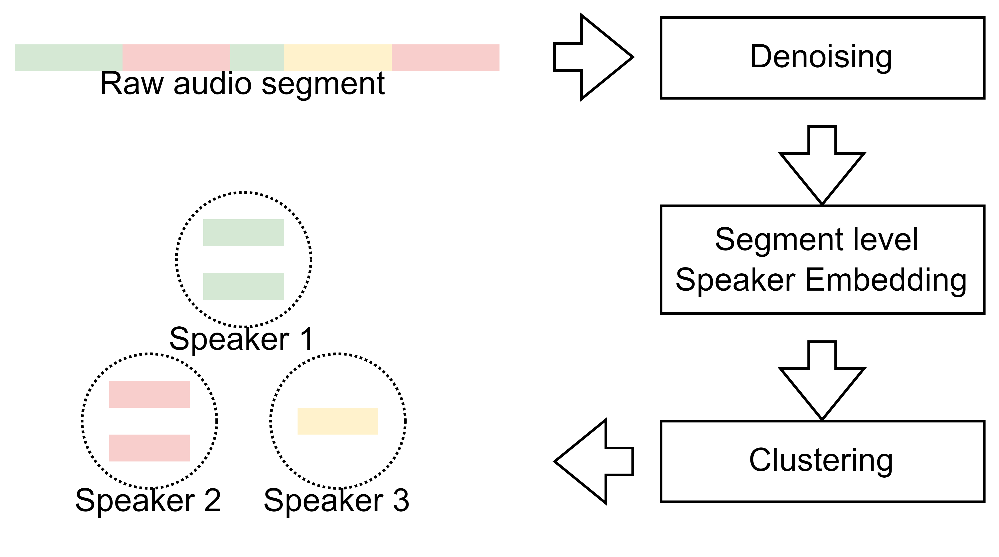

# Introuction

Here, we offer an unofficial, automatically generated speaker label of the WenetSpeech dataset for speech research.

The label is formulated with the kaldi utt2spk style as follows:
```
X0000018313_42315061_S00016 X0000018313_42315061_spk0
X0000018313_42315061_S00009 X0000018313_42315061_spk0
X0000018313_42315061_S00011 X0000018313_42315061_spk0
X0000018313_42315061_S00033 X0000018313_42315061_spk0
X0000018313_42315061_S00010 X0000018313_42315061_spk0
```

The first item represents the original utterance identity of WeNetSpeech, while the second term indicates the speaker label.


# Methods
 

The speaker label is generated through the following steps:
* Enhancing the original speech utterance using a state-of-the-art [band-split RNN (BSRNN)](https://arxiv.org/pdf/2212.00406.pdf) model.
* Calculating segment-level speaker embeddings using a pre-trained speaker verification model from [Wespeaker](https://github.com/wenet-e2e/wespeaker/). 
* For each long utterance, applying spectral clustering to the speech segments to generate the speaker labels.


# Download
The utt2spk file can be downloaded via [Link](https://drive.google.com/file/d/1UaGuyT1wcKc5g9vRdfIBvLoDRcuOxBlX/view?usp=drive_link).

# License 
<!-- Copyright 2023 Tencent AI Lab -->

**License**: [Creative Commons Attribution 4.0 International (CC BY-NC-SA 4.0)](https://creativecommons.org/licenses/by-nc-sa/4.0/).  